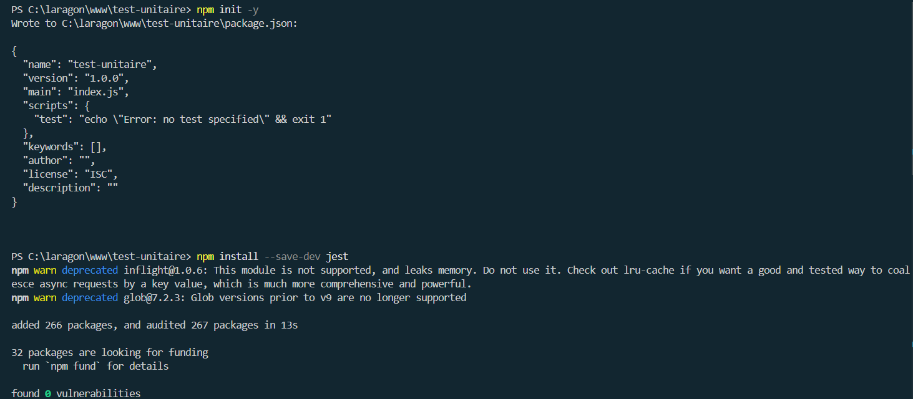
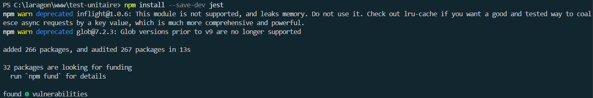
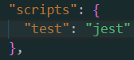
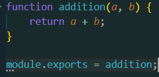
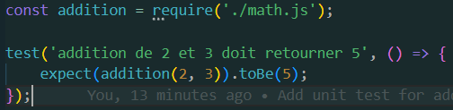
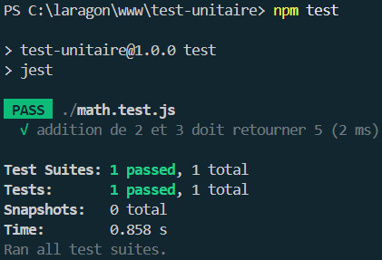
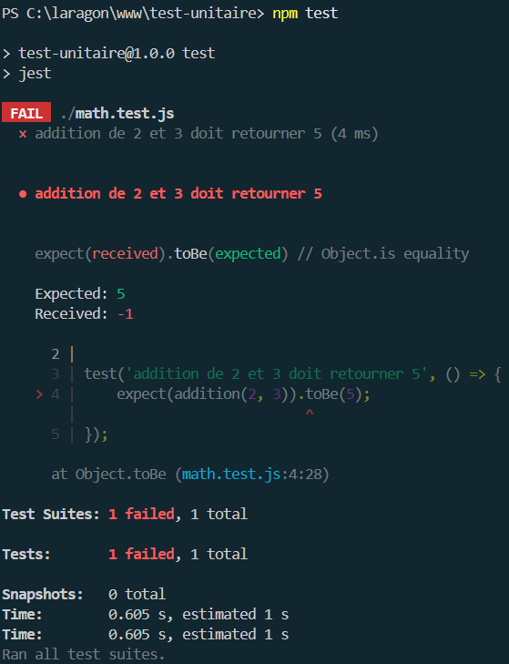
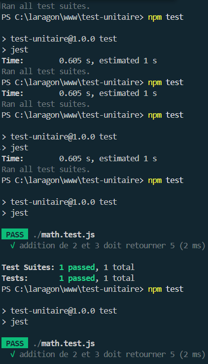

# 🧪 Mon Projet de Test Unitaire 🧪

Ce document explique comment j'ai mis en place un projet de test unitaire avec Jest pour JavaScript, de l'installation à la vérification des tests.

## 📋 Table des matières

- [🔧 Installation](#-installation)
- [📝 Création des fichiers](#-création-des-fichiers)
- [✅ Exécution des tests](#-exécution-des-tests)
- [🔄 Cycle de développement](#-cycle-de-développement)

## 🔧 Installation

### 1. Initialisation du projet

J'ai commencé par initialiser un nouveau projet Node.js :

```bash
npm init -y
```



### 2. Installation de Jest

J'ai ensuite installé Jest comme dépendance de développement :

```bash
npm install --save-dev jest
```



### 3. Configuration du script de test

J'ai modifié le fichier `package.json` pour configurer le script de test :

```json
{
  "scripts": {
    "test": "jest"
  }
}
```



## 📝 Création des fichiers

### 4. Création du module à tester

J'ai créé un fichier `math.js` contenant une fonction d'addition simple :

```javascript
function addition(a, b) {
    return a + b;
}

module.exports = addition;
```



### 5. Création du fichier de test

J'ai créé un fichier `math.test.js` pour tester la fonction d'addition :

```javascript
const addition = require('./math.js');

test('addition de 2 et 3 doit retourner 5', () => {
    expect(addition(2, 3)).toBe(5);
});
```



## ✅ Exécution des tests

### 6. Lancement des tests

J'ai exécuté les tests avec la commande suivante :

```bash
npm test
```



## 🔄 Cycle de développement

### 7. Ajout de nouveaux tests

J'ai continué à développer en suivant l'approche TDD (Test-Driven Development) :

1. Écrire un test qui échoue
2. Écrire le code minimal pour faire passer le test
3. Refactoriser le code



### 8. Vérification de la couverture de code

J'ai vérifié la couverture de code pour m'assurer que tous les cas sont testés :

```bash
npm test -- --coverage
```



## 🎉 Conclusion

Ce projet démontre comment mettre en place des tests unitaires simples avec Jest. Les tests unitaires sont essentiels pour garantir la qualité du code et faciliter la maintenance à long terme.

## 📚 Ressources utiles

- [Documentation officielle de Jest](https://jestjs.io/docs/getting-started)
- [Guide des tests unitaires en JavaScript](https://www.freecodecamp.org/news/how-to-start-unit-testing-javascript/)
